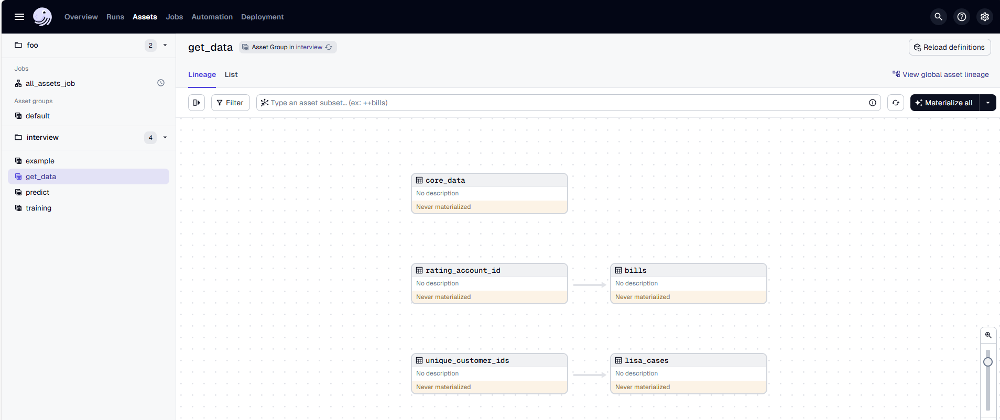
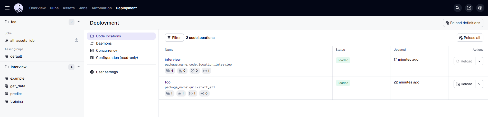

# Coding assignement for Data Scientist position in Magenta 

Hello! You made it! You passed to the second round of interview to become a Data Scientist in Magenta!  
This last step is meant to allow us to get to know eah other a bit better: you will have the opportunity to code in a developing environment that resamble the one we are going to use in Magenta.


### Quick start

This repository contains example pipelines and data for interview challenges.

> This is an instance of https://github.com/l-mds/local-data-stack it may be useful for your own data projects.
> To read more about this: https://georgheiler.com/post/lmds-template/


- Clone the repository in your GitHub space.
- Open a CodeSpace – it will take a while (1–2 minutes as it sets up the container).
- Then run in the terminal: `pixi run start-dev` – this command will start your Pixi environment.
- Go to `https://<your-code-space-name>-<random-chars>-3000.app.github.dev/` or click on **"Open in Browser"** in the pop-up that appears.  
  Here you can see the Dagster pipeline. Click on **"Materialize an asset"** to view the assets we have prepared for you.
- Work on the assignments.


## Your Assignment

Imagine you are a data scientist at Magenta and your task is to pitch a new use case for upselling activities to the marketing department.  
The goal of this project is to use machine learning to optimize which customers to target for upselling campaigns.

> **Upselling**: A customer purchases a better and more expensive version of a product.  
> Example: A customer currently has a mobile contract with 10 GB data. After a marketing intervention, they upgrade to a 50 GB tariff.

### The assignment consists of two parts:

### 1. Coding part

If possible, please integrate your code into this repository, following the structure and instructions provided.

We’ve prepared three sample datasets:

- `core_data`: contains core information about the contract
- `usage_info`: contains information about used data (GB) and roaming activity in the last 3 months
- `cases`: contains information about customer calls

To visualize all the sample datasets we have prepared for you, you need to materialize all the assets in `get_data` group in `interview` folder:
 

In this notebook: `notebooks/explore.ipynb` you can load the data you have materialized and you can explore them.

We ask you to contribute to this folder: `src/code_location_interview/code_location_interview/assets/magenta_interview`.
We have already created some structure there, but feel free to modify it how you think it's the best.

Each time you change an asset or you create a new one and you want to see your changes reflected in Dagster, simply reload the asset definitions:

### 2. Presentation part

You can use any presentation tool you prefer (e.g., PowerPoint).

Prepare a 15-minute presentation aimed at a non-technical business audience.

Imagine you are in the early phase of the project. After doing some exploratory analysis, you now want to present your idea to the business.
The presentation does not need to be limited to your code.  
You may assume you have access to more features or that you’ve tested additional modeling approaches.

Please address the following questions in your presentation:

- How would you communicate the business value of your solution to stakeholders?
- What is a clear metric to measure the success of your project?
- How would you compute the business value generated by your model?
- Which stakeholders would you involve, and at which stage of the project?
- What modeling approach would you use? (input features, model type, evaluation strategy, etc.)

## Useful literature

- pixi: https://pixi.sh/latest/advanced/installation/
- Dagster: https://dagster.io/ (for futher learning: https://courses.dagster.io/)
- dbt: https://www.getdbt.com/


## advanced usage
# ## docker

```bash
docker compose -f docker-compose.yml --profile dagster_onprem up --build
```

### .env  file

Post install:

- update the secrets in the `.env` files by executing: `openssl rand -base64 32` and setting a suitable secret
- ensure the `.env.enc` can be created by following the instructions in [documentation/secops]

here you find an example `.env` file which should have been auto-generated

```
DO_NOT_TRACK=1

WAREHOUSE_DAGSTER_HOSTNAME=dagster_db
WAREHOUSE_DAGSTER_DB=dagster
WAREHOUSE_DAGSTER_USER=dagster
# openssl rand -base64 32
WAREHOUSE_DAGSTER_PASSWORD=<<your-secret>>

# only set this for dev mode!
DAGSTER_IS_DEV_CLI=True

# only set in the container (should be done from CI pipeline)
#DAGSTER_CLOUD_DEPLOYMENT_NAME=techexploration
#DAGSTER_CLOUD_GIT_URL=https://github.com/myorg/interview
#DAGSTER_CLOUD_GIT_SHA=<<your sha>>
#DAGSTER_CLOUD_GIT_BRANCH=main
```
